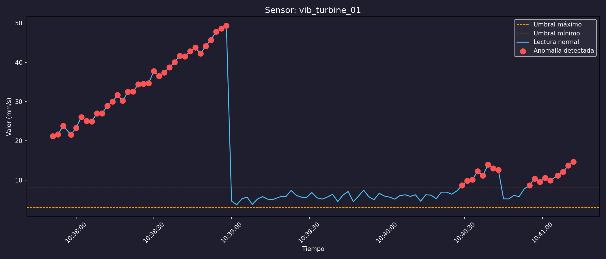
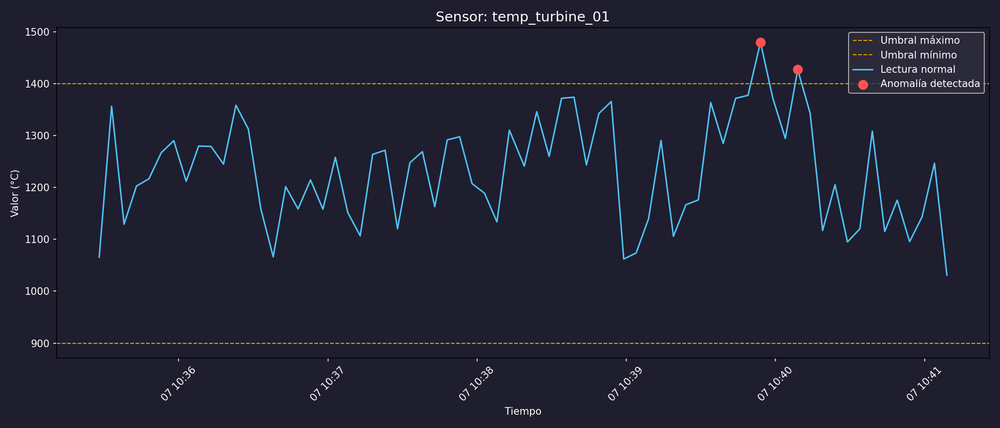
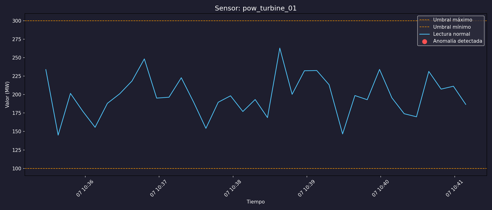
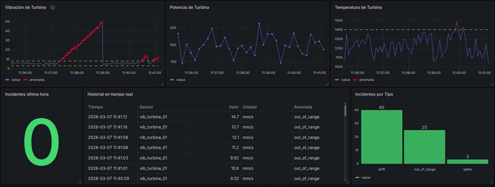

# Argus — Real-time IoT Sensor Monitoring System with Anomaly Detection

**Argus** es un sistema de monitoreo en tiempo real de sensores IoT con detección de anomalías, construido con **Python, FastAPI, MySQL y Docker**. Permite simular datos de sensores, almacenar lecturas en una base de datos, detectar anomalías (picos, deriva o valores fuera de rango) y generar alertas inmediatas, con visualización gráfica de los resultados.

Desarrollado como proyecto personal para explorar arquitecturas IoT aplicadas a entornos industriales.

---

## Parámetros a Analizar

| Parámetro                                    | Rango típico                          | Límite crítico         | Observaciones                                                                                                                   |
| -------------------------------------------- | ------------------------------------- | ---------------------- | ------------------------------------------------------------------------------------------------------------------------------- |
| **Temperatura (gases que impactan palas)**   | 1200–1400 °C                          | >1400 °C               | Indica el estrés térmico sobre las palas; valores mayores requieren revisión y control de enfriamiento.                         |
| **Potencia (Power / Output)**                | 24–35 MW (turbina industrial mediana) | Caídas súbitas >10–15% | Analiza eficiencia y posibles pérdidas por daño en palas o problemas de combustión.                                             |
| **Vibración (Vibration / Cojinetes y ejes)** | 3–8 mm/s r.m.s.                       | >8 mm/s                | Valores altos pueden indicar desbalance, desgaste de cojinetes o daño en palas; correlacionar con temperatura para diagnóstico. |

**Nota:** Los valores son representativos de turbinas de gas industriales típicas.
El análisis se centrará en la **correlación entre temperatura, potencia y vibración**, buscando tendencias y anomalías que puedan indicar riesgo de fallo o reducción de eficiencia.

---

## Características

* Simulación de datos de sensores con ruido y anomalías aleatorias.
* Detección de tres tipos de anomalías: **spike**, **deriva** y **fuera de rango**.
* API REST con **FastAPI** para acceder a datos y anomalías.
* Visualización de datos con **matplotlib**, incluyendo anomalías detectadas.
* Persistencia en **MySQL** con modelos definidos en **SQLAlchemy**.
* Arquitectura preparada para **dockerización** y despliegue escalable.
* Sistema modular y testeable para asegurar la calidad del código.

---

## Stack

| Capa | Tecnología |
|---|---|
| Lenguaje | Python 3.11 |
| API | FastAPI + Uvicorn |
| Base de datos | MySQL 8.0 |
| ORM | SQLAlchemy |
| Validación | Pydantic v2 |
| Visualización | Matplotlib, Grafana |
| Infraestructura | Docker, Docker Compose |

---

## Estructura del Proyecto

```
argus/
├── sensors/
│   └── simulator.py       # Genera datos de turbina con ruido gaussiano y estados de fallo
├── storage/
│   ├── database.py        # Conexión a MySQL y gestión de sesiones SQLAlchemy
│   └── models.py          # Modelos ORM: Reading, Anomaly
├── analysis/
│   └── analyzer.py        # Detección de anomalías: spike, out_of_range, drift
├── api/
│   ├── main.py            # Instancia y arranque de FastAPI
│   ├── routes.py          # Endpoints: /readings, /readings/{sensor_id}, /anomalies
│   └── schemas.py         # Schemas Pydantic para serialización
├── dashboard/
│   └── plot.py            # Gráficas por sensor con anomalías marcadas
├── scripts/
│   └── init_db.py         # Inicialización de tablas en MySQL
├── docs/
│   └── architecture.md    # Decisiones de diseño y flujo de datos
├── main.py                # Punto de entrada con threading por sensor
├── config.py              # Configuración centralizada
├── docker-compose.yml
└── requirements.txt         
```

El simulador genera lecturas concurrentes para tres sensores usando threads independientes. Cada lectura se almacena en MySQL y se analiza en tiempo real. Si se detecta una anomalía, se registra en la tabla `anomaly` con referencia a la lectura original.

---

## Sensores y umbrales

| Sensor | Tipo | Rango normal | Unidad | Intervalo |
|---|---|---|---|---|
| temp\_turbine\_01 | Temperatura | 900 – 1400 | °C | 5 s |
| pow\_turbine\_01 | Potencia | 100 – 300 | MW | 10 s |
| vib\_turbine\_01 | Vibración | 3 – 8 | mm/s | 2 s |

---

## Tipos de anomalías

| Tipo | Descripción |
|---|---|
| spike | Un único valor fuera de rango aislado |
| out\_of\_range | Varios valores consecutivos fuera de rango |
| drift | Todos los valores del historial reciente fuera de rango — degradación progresiva |

---

## API REST

Con el servidor corriendo, la documentación interactiva está disponible en `http://localhost:8000/docs`.

| Método | Endpoint | Descripción |
|---|---|---|
| GET | `/readings` | Últimas 100 lecturas de todos los sensores |
| GET | `/readings/{sensor_id}` | Últimas 100 lecturas de un sensor específico |
| GET | `/anomalies` | Todas las anomalías registradas |

---

## Visualización

### Matplotlib

Genera una gráfica por sensor con anomalías marcadas en rojo y umbrales operacionales visibles.

```bash
python3 -c "from dashboard.plot import plot_sensor; plot_sensor('vib_turbine_01')"
```





### Grafana

Dashboard en tiempo real accesible en `http://localhost:3000`.

Incluye paneles de series temporales por sensor, historial de anomalías, contador de incidentes de la última hora y distribución de anomalías por tipo.



---

## Instalación y uso

### Requisitos

- Python 3.11+
- Docker y Docker Compose

### Pasos

```bash
# Clonar el repositorio
git clone https://github.com/Remorus/argus.git
cd argus

# Crear entorno virtual e instalar dependencias
python3 -m venv venv
source venv/bin/activate
pip install -r requirements.txt

# Copiar el archivo de entorno
cp .env.example .env

# Levantar MySQL y Grafana
docker-compose up -d

# Inicializar la base de datos y arrancar el simulador
python3 main.py
```

La API arranca en un proceso separado:

```bash
python3 -m uvicorn api.main:app --reload
```

---

## Roadmap

- [ ] Despliegue en Raspberry Pi para monitorización con hardware real
- [ ] Conexión con sensores BLE reales
- [ ] Autenticación en la API
- [ ] Modelos de detección de anomalías basados en ML (isolation forest, LSTM)
---

## Autor

Pablo Romero Blanco — [GitHub](https://github.com/Remorus)